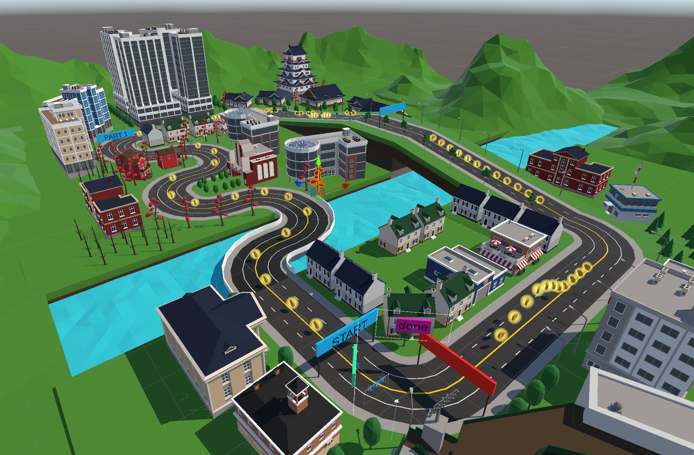

## The Assignment:
Given a Unity Vr - Parcour, implement a unique locomotion-technique to traverse it and a corresponding interaction technique for your Meta Quest to solve the interaction tasks in it.

## Brainstorming
The Brainstorming started immediately in class, interesting and unique ideas with many difficulty levels and twists. We weighted enjoyment and motion-sickness levels of our ideas and theorized the workload. While doing all of that with my peers I had only one picture in my mind: Parzival opening his inventory in Ready Player One (Great Film, go watch it), grabbing the DeLorean and driving off. I always will instantly connect VR to RPO and I really liked the idea of implementing a similar menu, especially knowing my ass being prone to not be able to choose only one thing. The Menu was the way.

## Core concepts
I have no faith in my own programming skills, especially given a completely new environment, so I wanted an overlay, that enabled me to always fall back into the working legacy-techniques, if some of my own techniques would prove broken or buggy. Naturally I wanted to integrate every new technique seperately in closed environments, switching between them seamlessly through te menu.
This created a whole lot of other difficulties, but thats a story for the implementation part.